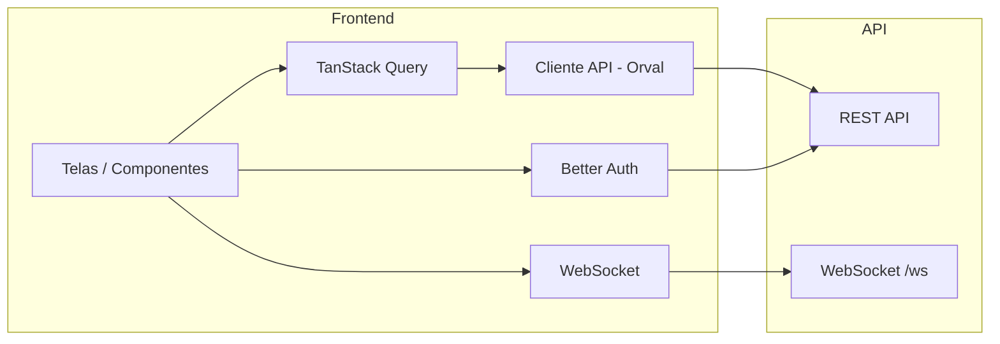

# Axisor Kanban — Frontend

Interface da aplicação Kanban (Axisor), construída com **TanStack Start**, **Vite** e **React**.

## Tecnologias principais

- **TanStack Start** — full-stack React (SSR, file-based routing)
- **TanStack Router** — roteamento
- **TanStack Query** — cache e requisições (integrado ao cliente gerado pelo Orval)
- **Orval** — geração do cliente HTTP e tipos a partir do OpenAPI da API
- **Tailwind CSS** — estilos
- **Shadcn** — componentes acessíveis (dialogs, dropdowns, etc.)
- **@dnd-kit** — drag and drop no quadro Kanban
- **Zustand** — estado global (ex.: notificações de scan de anexos)
- **Better Auth** — autenticação (client)
- **WebSocket** — atualizações em tempo real (status de anexos)
- **Vitest** + **Testing Library** — testes e2e

## Fluxo principal (frontend ↔ API)



Fluxo resumido: o usuário interage com a UI; dados são carregados e mutados via TanStack Query usando funções geradas pelo **Orval**; a autenticação usa **Better Auth** contra a API; o **WebSocket** mantém o quadro atualizado em tempo real (ex.: resultado do scan de anexos).

## Pré-requisitos

- [Node.js](https://nodejs.org/) 18+ (ou Bun)
- [pnpm](https://pnpm.io/) (recomendado)

A API deve estar rodando (ex.: `http://localhost:3333`) para login e dados. Para atualizações em tempo real de anexos, o backend deve estar com Redis e workers BullMQ ativos.

## Setup

1. **Dependências**

   ```bash
   pnpm install
   ```

2. **Variáveis**

   Configure a URL da API onde for necessário (ex.: env do Vite ou no Orval). O `orval.config.ts` usa `baseUrl: 'http://localhost:3333'` e `input.target: 'http://localhost:3333/openapi/json'`.

3. **Gerar cliente da API (Orval)**

   Com a API rodando e expondo `/openapi/json`:

   ```bash
   pnpm run generate:api
   ```

   Isso gera/atualiza os hooks e tipos em `src/lib/api/` (por tag: project, label, column, task, attachment) e modelos em `src/lib/api/model/`. Não edite esses arquivos manualmente.

4. **Rodar em desenvolvimento**

   ```bash
   pnpm dev
   ```

   O app sobe em `http://localhost:3000` (porta configurável no script).

## Scripts

| Script               | Descrição                              |
|----------------------|----------------------------------------|
| `pnpm dev`           | Servidor de desenvolvimento (Vite)     |
| `pnpm build`         | Build de produção                      |
| `pnpm preview`       | Preview do build                       |
| `pnpm run generate:api` | Gera cliente e tipos com Orval     |

## Orval

O front não define os endpoints manualmente: eles vêm do **OpenAPI** da API.

- **Config**: `orval.config.ts` — `input.target` aponta para `http://localhost:3333/openapi/json`, com filtro para excluir a tag "Better Auth".
- **Output**: cliente **React Query** em `src/lib/api/` (por tag), com `credentials: 'include'` para cookies de sessão.
- **Uso**: importe os hooks gerados (ex.: `getGetColumnsWithTasks`, `postTasks`, etc.) e use com TanStack Query.

Sempre que a API mudar o contrato, rode `pnpm run generate:api` com a API no ar.

## WebSocket (anexos)

O hook `useAttachmentSocket(projectId)` conecta em `ws://localhost:3333/ws?projectId=<id>` e escuta o evento `attachment_scanned`. Quando o backend publica o resultado do scan (via Redis), o front:

- invalida as queries de anexos da task
- atualiza o estado de “scanning” (Zustand)
- exibe toasts (Sonner) conforme o status: clean, infected ou error

A URL do WebSocket está fixa no código; em produção, use a mesma origem ou variável de ambiente.

## Estilo e componentes

- **Tailwind CSS** para utilitários e tema.
- **Radix UI** para acessibilidade (modais, selects, etc.).
- **Shadcn**: você pode adicionar componentes com `pnpm dlx shadcn@latest add <component>`.

## Documentação de design (Figma)

**Figma (esboço e fluxos):** _[Figma do projeto (apenas para ter ideias)](https://www.figma.com/design/ac5kag9EbOqxXxyhrk5XXW/Axisor---Kanban?node-id=4011-3&t=Ns15oyktYfTqBxji-1)_


## Outros pontos

- **Rotas**: file-based em `src/routes/` (TanStack Router). Layout global em `__root.tsx`.
- **Autenticação**: Better Auth (client) com sessão em cookie; rotas protegidas via layout `_auth`.
- **Drag and drop**: @dnd-kit para colunas e cards; reordenação persiste via API (columns reorder, tasks reorder).
- **Anexos**: upload via API; download via URL pré-assinada (MinIO). Para simular vírus/erro no scan, use no backend arquivos com nome `virus.pdf` ou `error.pdf` (detalhes no README da API).
